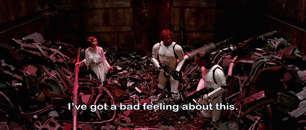

# **A Jamstack Journey**

@llyorshch
jorge@ge.org.es

---
<!-- _class: lead -->
# "I need a web page"

---
<!-- _class: lead -->
# "I already have hosting"

---
# Done! <!--fit-->

--- 
<!-- _class: lead -->

Of course not

---

# What's the matter?

--- 

# What's the matter?

--- 

### Why?

- To deliver HTML, you don't need a LAMP stack
  

---

# Enter Jamstack

---
# Jamstack Runtime Architecture

---
# Jamstack Workflow

---
# Ok but, why Jamstack?

My take on this:

* Better developer experience (Modern tools, Git, Markdown) 🤓
* No security issues → Peace of mind 💆🏻
* Damn fast 🚴🏻‍♀️💨
---
# Ok but, why Jamstack?

My take on this:

- Better developer experience (Modern tools, Git, Markdown) 🤓
- No security issues → Peace of mind 💆🏻
- Damn fast 🚴🏻‍♀️💨

But also...

* Scalability
* Portability
* Maintainability

---

# Cool. What next?

---

# (Some) Site Generators [(all)](https://jamstack.org/generators/)

|  | Tech | Leitmotif |
| --- | --- | --- |
|  | Ruby | The grandfather adopted by GitHub |
|  | Js & React | Almighty Web Dev Framework |
|  | Js & React | Also React but more CMS based |
|  | Js & Vue | For the Vue.js fans |
|  | Go | Batteries included and ready to "go" |

---

# My Choice (YMMV)

* I am not a Javascript developer
* I don't like Ruby (but Jekyll is nice)
* The learning curve was less overwhelming

---
# Pros and cons
