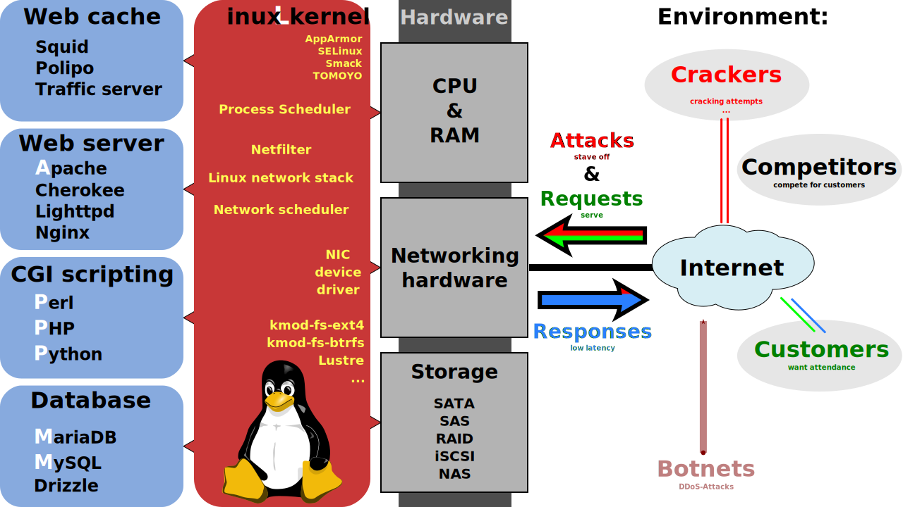
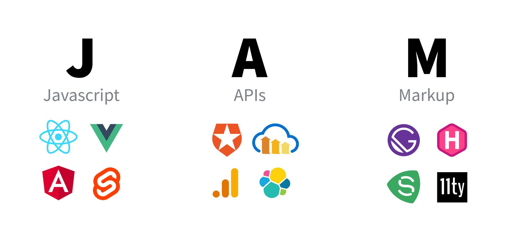
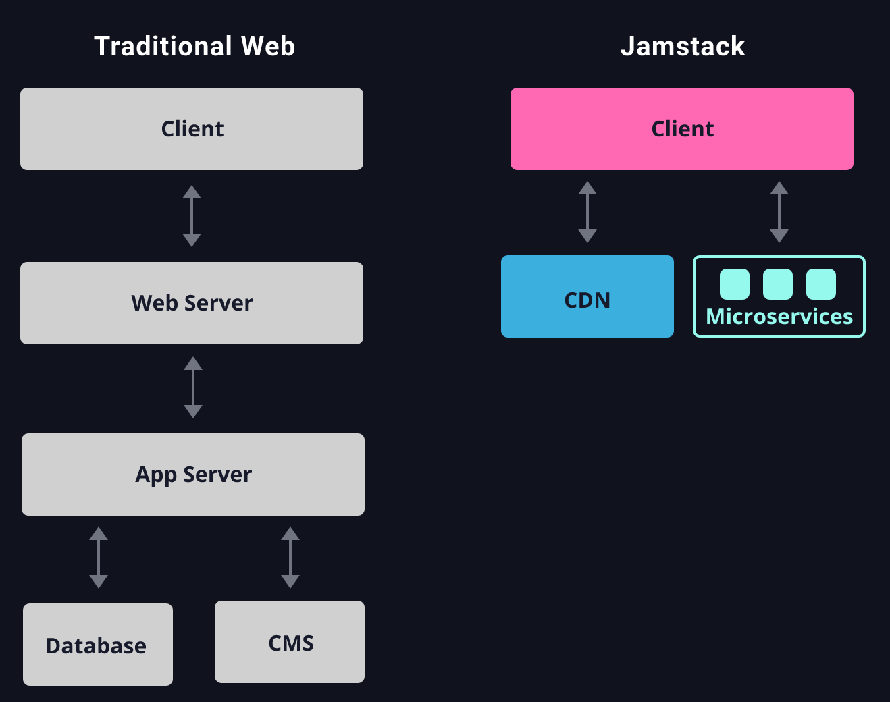
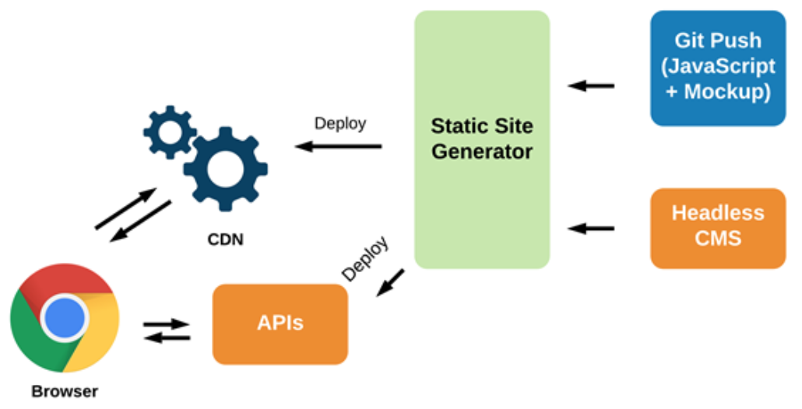

# **A Jamstack Journey**

@llyorshch
jorge@ge.org.es

---
<!-- _class: lead -->
# I need a web page

---
<!-- _class: lead -->
# I already have hosting

---
# Done <!--fit-->

--- 
<!-- _class: lead -->

Of course not

---

# What's the matter?

--- 

# What's the matter?
<!-- _class: subLead -->
## **YAGNI**  

--- 

### Why?

- To deliver HTML, you don't need a LAMP stack
  

---

# Enter Jamstack

---
# Jamstack Runtime Architecture

---
# Jamstack Workflow

---
# Ok but, why Jamstack?

My take on this:

* Better developer experience (Modern tools, Git, Markdown) 🤓
* No security issues → Peace of mind 💆🏻
* Damn fast 🚴🏻‍♀️💨
---
# Ok but, why Jamstack?

My take on this:

- Better developer experience (Modern tools, Git, Markdown) 🤓
- No security issues → Peace of mind 💆🏻
- Damn fast 🚴🏻‍♀️💨

But also...

* Scalability
* Portability
* Maintainability