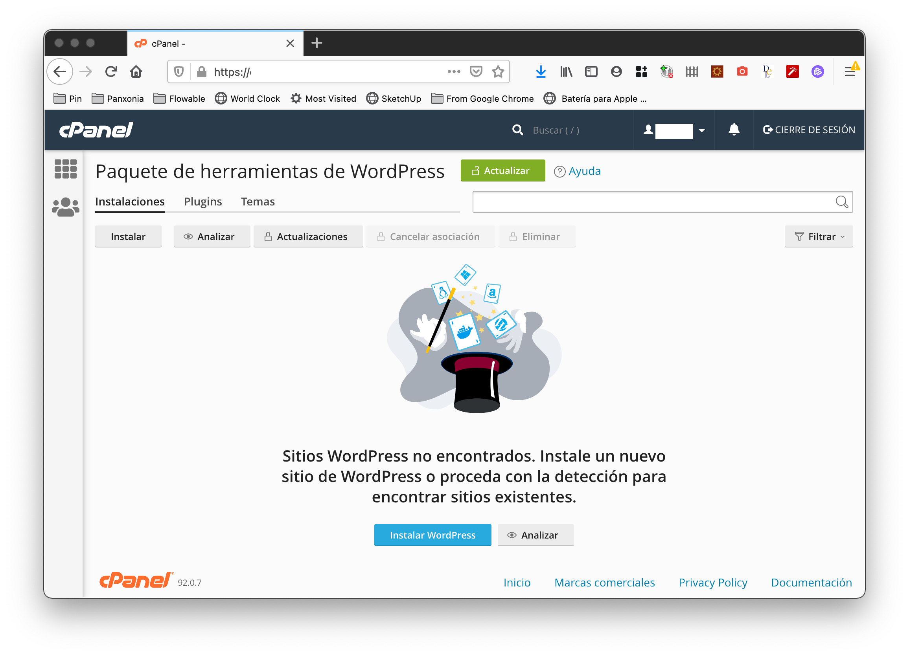

# **A Jamstack Journey**

@llyorshch
jorge@ge.org.es

---
<!-- _class: lead -->
# I need a web page

---
<!-- _class: lead -->
# I already have hosting

---
# Done <!--fit-->

--- 
<!-- _class: lead -->

Of course not